# Warranty Claims AI Processing System

An intelligent, multi-agent AI system for automated warranty claim processing. This application uses LangGraph-orchestrated agents to triage incoming customer emails, analyze warranty eligibility, retrieve relevant policy documents via RAG, and generate human-reviewed recommendations—all powered by Groq's fast LLM inference.

## Overview

This system processes customer warranty claim emails through a sophisticated pipeline:

1. **Email Triage Agent** - Categorizes incoming emails (spam, warranty claims, non-warranty inquiries)
2. **RAG Recommendation Agent** - Retrieves policy documents and generates structured warranty claim recommendations
3. **Human Review** - Collects reviewer feedback on AI recommendations
4. **Response Generation** - Drafts personalized response emails based on decisions
5. **Decision Recording** - Logs all decisions for audit and analysis

## Features

- **Multi-Agent Architecture**: LangGraph-based workflow orchestration with specialized agents
- **Intelligent Triage**: Categorizes emails using Groq LLM (mixtral-8x7b)
- **RAG-Powered Policy Analysis**: Pinecone vector database for policy document retrieval and matching
- **Structured Decisions**: Generates JSON-formatted warranty recommendations with confidence scores
- **Human-in-the-Loop**: Optional human reviewer approval/rejection of AI decisions
- **Email Response Generation**: Automatically drafts approval, rejection, or escalation emails
- **Decision Audit Trail**: Records all triage and claim decisions to JSON files with summary statistics
- **Robust Error Handling**: Fallback mechanisms for graceful degradation

## Technical Stack

- **Framework**: LangGraph + StateGraph for workflow orchestration
- **LLM**: Groq ChatGroq (mixtral-8x7b-32768)
- **Vector Database**: Pinecone for policy document storage and retrieval
- **Data Validation**: Pydantic models for structured outputs
- **File Processing**: JSON-based email and policy document handling
- **Logging**: Comprehensive debug and info level logging

## Project Structure

```
Agentic_AI_Warranty_claims_processing/
├── main_orchestrator.py           # Complete pipeline orchestration
├── claims_processing_agent.py     # Email triage agent
├── RAG_recommender_agent.py       # RAG-based recommendation engine
├── vector_db.py                   # Pinecone vector database wrapper
├── Mailbox_mockup.py              # Email file system adapter
├── model_config.ini               # LLM and model configuration
├── requirements.txt               # Python dependencies
├── test_customer_emails/          # 20 test emails (warranty, spam, non-warranty)
├── warranty_documents/            # Policy PDFs indexed in vector DB
├── decision_logs/                 # Output: Decision records and summaries
├── response_emails/               # Output: Generated response emails
└── inbox/                         # Optional: Live email processing directory
```

## Installation

1. **Clone and Navigate**
   ```bash
   cd Agentic_AI_Warranty_claims_processing
   ```

2. **Install Dependencies**
   ```bash
   pip install -r requirements.txt
   ```

3. **Set Environment Variables**
   ```bash
   export GROQ_API_KEY="your-groq-api-key"
   export PINECONE_API_KEY="your-pinecone-api-key"  # If using Pinecone
   ```

4. **Create .env File** (Alternative to export)
   ```
   GROQ_API_KEY=your-groq-api-key
   PINECONE_API_KEY=your-pinecone-api-key
   ```

## Configuration

Edit `model_config.ini` to customize:

```ini
[MODEL_CONFIG]
vlm_model=mixtral-8x7b-32768          # Triage agent model
rag_model=mixtral-8x7b-32768          # RAG recommendation model
response_drafter_model=mixtral-8x7b-32768  # Response drafting model

[EMAILS]
customer_mails=test_customer_emails   # Email input directory
```

## Execution

### Run Full Pipeline (with Human Review)

```bash
python3 main_orchestrator.py
```

This processes all emails in the configured inbox directory through the complete workflow:
- Triages each email
- Generates warranty recommendations
- Prompts for human review (approve/reject/revise)
- Drafts response emails
- Records all decisions

**Output**:
- `decision_logs/triage_decisions_YYYYMMDD_HHMMSS.json` - Triage decisions for all emails
- `decision_logs/claim_decisions_YYYYMMDD_HHMMSS.json` - Warranty claim decisions
- `decision_logs/summary_YYYYMMDD_HHMMSS.json` - Summary statistics
- `response_emails/response_YYYYMMDD_HHMMSS.json` - Generated response emails

### Test Components

**Test Email Triage**
```bash
python3 claims_processing_agent.py
```

**Test RAG Recommendation**
```bash
python3 test_full_rag.py
```

**Test JSON Parsing**
```bash
python3 test_parse_response.py
```

## Data Models

### HumanReviewPacket
Structured recommendation packet containing:
- `claim_validity`: Valid | Invalid | Uncertain
- `warranty_coverage`: Covered | Not Covered | Partially Covered
- `decision`: Approve Claim | Reject Claim | Escalate for Further Review
- `confidence_score`: 0.0-1.0
- `reasons`: List of justification strings
- `next_steps`: List of recommended actions
- `notes`: Additional context

### ClaimRecommendation (JSON Format)
LLM-generated recommendation with validated fields matching HumanReviewPacket structure.

## Workflow Pipeline

### Orchestration Flow Diagram

```mermaid
flowchart TD
    Start(["📨 Start: Email Received"]) --> LoadEmail["Load Email from Mailbox"]
    LoadEmail --> Triage["📧 Email Triage Agent<br/>(Groq LLM)"]
    
    Triage --> TriageDecision{"Category?"}
    
    TriageDecision -->|Spam| DisplaySpam["🚫 Display Spam Alert"]
    DisplaySpam --> End1(["✓ End: Spam Filtered"])
    
    TriageDecision -->|Non-Warranty| DisplayNW["💬 Display Non-Warranty<br/>Inquiry"]
    DisplayNW --> End2(["✓ End: Info Provided"])
    
    TriageDecision -->|Warranty Claim| RAGStart["🔍 RAG Recommendation<br/>Agent"]
    
    RAGStart --> ExtractCat["1. Extract Category<br/>& Product Model"]
    ExtractCat --> RetrievePolicies["2. Retrieve Policy<br/>Documents<br/>(Pinecone VectorDB)"]
    RetrievePolicies --> AnalyzePolicy["3. Analyze Against<br/>Policy<br/>(Groq LLM)"]
    AnalyzePolicy --> GenRec["4. Generate<br/>Recommendation<br/>(JSON Structure)"]
    GenRec --> CreatePacket["5. Create Review<br/>Packet<br/>(HumanReviewPacket)"]
    
    CreatePacket --> HumanReview["👤 Human Review<br/>(Interactive)"]
    
    HumanReview --> ReviewDecision{"Reviewer<br/>Decision?"}
    
    ReviewDecision -->|Approve| DraftApprove["✅ Draft Approval<br/>Email<br/>(Groq LLM)"]
    DraftApprove --> SaveResponse["💾 Save Response<br/>Email to JSON"]
    SaveResponse --> RecordDecision["📝 Record Decision<br/>to Audit Log"]
    RecordDecision --> End3(["✓ End: Approved"])
    
    ReviewDecision -->|Reject| DraftReject["❌ Draft Rejection<br/>Email<br/>(Groq LLM)"]
    DraftReject --> SaveResponse
    
    ReviewDecision -->|Escalate| DraftEscalate["⚠️ Draft Escalation<br/>Email<br/>(Groq LLM)"]
    DraftEscalate --> SaveResponse
    
    ReviewDecision -->|Revise| RAGStart
    
    RecordDecision --> SummaryGen["📊 Generate Decision<br/>Summary<br/>(Statistics)"]
    SummaryGen --> End4(["✓ End: Complete"])
    
    style Start fill:#e1f5e1
    style End1 fill:#e1f5e1
    style End2 fill:#e1f5e1
    style End3 fill:#e1f5e1
    style End4 fill:#e1f5e1
    style DisplaySpam fill:#ffe1e1
    style DisplayNW fill:#fff5e1
    style HumanReview fill:#e1e5ff
    style Triage fill:#e1f5ff
    style RAGStart fill:#ffe1f5
    style SaveResponse fill:#e1f5f5
    style RecordDecision fill:#f5e1ff
```



### Process Details

**Phase 1: Email Triage**
- Analyzes incoming email
- Categorizes as: Spam, Warranty Claim, or Non-Warranty Inquiry
- Uses Groq LLM for intelligent classification

**Phase 2: RAG Recommendation** (Warranty Claims Only)
1. **Extract Category**: Identifies product model and issue type
2. **Retrieve Policies**: Queries Pinecone vector DB for relevant warranty policies
3. **Analyze Policy**: LLM analyzes claim against retrieved policies
4. **Generate Recommendation**: Creates structured JSON recommendation
5. **Create Packet**: Packages recommendation as HumanReviewPacket

**Phase 3: Human Review**
- Displays AI recommendation to reviewer
- Options: Approve, Reject, Escalate, or Revise
- Collects optional feedback and reviewer ID

**Phase 4: Response Generation**
- Drafts personalized email based on decision
- Uses Groq LLM for professional communication
- Saves response to JSON file

**Phase 5: Decision Recording**
- Records all decisions to audit log
- Generates summary statistics
- Tracks approval rates and confidence scores

## Logging

Enable debug logging by setting environment variable:
```bash
export LOG_LEVEL=DEBUG
```

Logs show:
- Email processing progress
- LLM invocations and responses
- JSON parsing strategy selection
- Policy document retrieval results
- Decision reasoning

## Error Handling

- **Missing Policy Documents**: Falls back to general warranty guidance
- **LLM Parsing Failures**: Creates fallback recommendation with "Escalate for Further Review"
- **Invalid Email Format**: Logs error and skips processing
- **API Failures**: Retries with exponential backoff (configurable)

## Testing

The system includes 20 test emails covering:
- **Warranty Claims** (11): Valid claims within warranty, various product models
- **Spam** (5): Marketing emails, irrelevant inquiries
- **Non-Warranty** (4): Feature questions, product feedback

Run tests:
```bash
python3 main_orchestrator.py  # Processes all 20 test emails
```

## Decision Records

All decisions are saved as JSON for audit and reporting:

## Future Enhancements

- [ ] Database integration for claim history
- [ ] Advanced confidence thresholding for automatic approvals
- [ ] Batch processing with progress reporting
- [ ] Custom policy template system
- [ ] Integration with email systems (Gmail, Outlook)